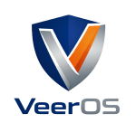

<!-- LOGO PLACEHOLDER -->

# VeerOS

**VeerOS** is a lightweight, secure, and experimental operating system designed for embedded devices (ESP32 RISC-V).  
Built in Rust, VeerOS explores modern OS concepts — secure boot, OTA updates, and remote management — while staying minimal and educational.

---

## ✨ Features
- Secure Boot  
- OTA Updates  
- UEFI-like Bootloader  
- Networking Stack  
- SSH Access (planned)  
- Rust-based Kernel  

---

## 🚀 Roadmap
- [x] Bootloader with menu  
- [x] Secure boot verification  
- [x] OTA slot + fallback kernel  
- [ ] TCP/IP stack  
- [ ] SSH daemon  
- [ ] Filesystem + shell  

---

## 📂 Repository Structure

```text
/bootloader   -> Stage 1 loader
/kernel       -> Core OS kernel
/net          -> Networking stack
/shell        -> Command interpreter
/docs         -> Documentation
