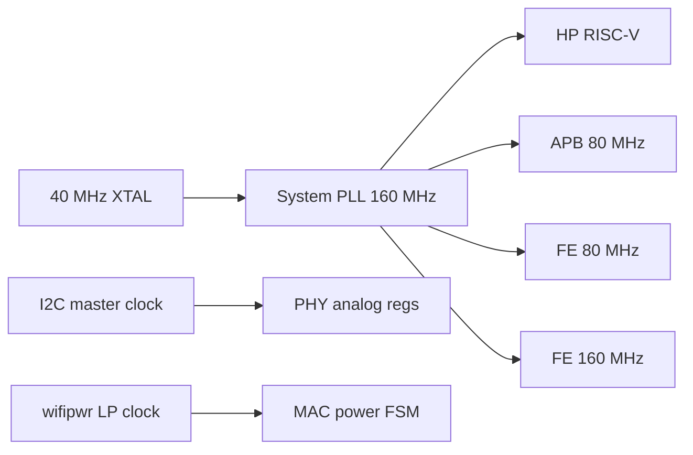
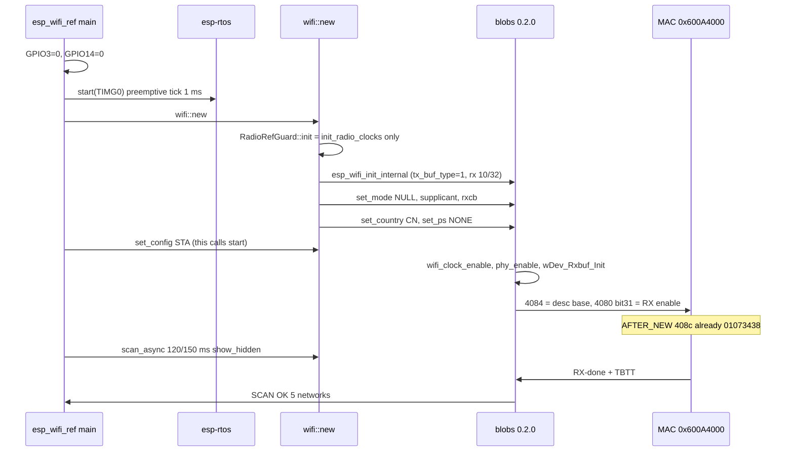

# ESP32-C6 Wi-Fi Bring-up on VeerOS

A first-principles tutorial: from the ceramic antenna, through clocks, blobs,
the OSI adapter, MAC DMA, and interrupts, to the one register that tells you
whether a packet ever became real.

> **Status (2026-09-18).** Same room, two Seeed XIAO ESP32-C6 boards, same
> blobs (`esp-wifi-sys-esp32c6 0.2.0`). Gold (`esp_wifi_ref` + `esp-radio`
> 0.18 + `esp-rtos`) scans **5 APs**. VeerOS scans **0 APs**. PHY calibration
> succeeds (`calret=1`). The MAC interrupt line fires hundreds of times, but
> the cause register is only ever bit 7 (`0x80`) — a timer, not RX-done.
> `0x600a408c` (last completed RX descriptor) stays `0`. Analog energy exists;
> 802.11 demod never delivers an MPDU. MMIO-poking post-RX symptoms has been
> reverted. This document is the map of everything that *is* known.

---

## 0. How to read this

This is written for a novice who has never seen a Wi-Fi MAC, and for the
person who has to finish the last millimetre. Read §1–§6 for the picture.
Read §7–§12 for the machinery. Read §13–§15 with the source open. Read
§16–§18 when you are about to change code. Skip nothing in §11: almost every
failed experiment in this bring-up was a misunderstanding of `0x600a408c`.

**Two firmwares, two serial ports, this session**

| Role | Port | STA MAC | Firmware | Scan |
|---|---|---|---|---|
| Gold | `/dev/cu.usbmodem101` | `40:4c:ca:5a:4e:1c` | `esp_wifi_ref` (esp-radio 0.18, esp-rtos, blobs 0.2.0) | 5 APs (`MARS` −58 dBm ch1, …) |
| VeerOS | `/dev/cu.usbmodem1101` | `40:4c:ca:5a:4d:e4` | `kernel-xiao-esp32c6` (same blobs 0.2.0) | 0 APs |

Hardware is exonerated: Arduino and gold both hear the room on these
boards. The remaining miss is firmware integration, not a broken radio.

---

## 1. The one-sentence problem

Wi-Fi on ESP32-C6 is not a driver you write. It is a **closed firmware
image** (the “blobs”) that expects FreeRTOS, a specific clock sequence, a
function-pointer table called `wifi_osi_funcs_t`, and a radio that is
already pointed at the antenna. VeerOS replaces FreeRTOS. Bring-up is the
work of making the blobs believe they still live in ESP-IDF — closely
enough that the analog PHY demodulates 802.11 and the MAC writes a
completed descriptor.

```text
                    the air
                      │
                      ▼
              ceramic antenna
                      │
              FM8625H RF switch   GPIO3=0 (enable), GPIO14=0 (ceramic)
                      │
              analog PHY / FE     0x600A8000  (IQ, mixers, AGC)
                      │
              baseband            0x600A7800  (demod, CCA)
                      │
              Wi-Fi MAC           0x600A4000  (DMA descriptors, filters, IRQ)
                      │
              blobs (libpp, libnet80211, libphy)
                      │
              wifi_osi_funcs_t    queues, timers, malloc, ISR, phy_enable
                      │
              VeerOS  ── or ──  esp-rtos (gold)
```

If any layer is wrong, the symptom is always the same: **scan returns 0**.
The art is not more logs. It is knowing *which* layer is silent.

---

## 2. A 30-second intuition: what “hearing Wi-Fi” means

A nearby access point shouts a **beacon** every ~102.4 ms on one 2.4 GHz
channel (1–13). That shout is:

1. RF energy at 2.4 GHz (the antenna must be connected — §5).
2. A DSSS/OFDM waveform the analog PHY must mix down and sample.
3. A demodulated **MPDU** (MAC frame) the baseband writes into RAM.
4. A **descriptor** the MAC updates to say “this buffer is done”.
5. A **MAC interrupt** whose cause bits include RX-complete, not just
   the beacon timer.
6. Blob code (`wDev_ProcessFiq` → net80211 → scan table) that reads the
   descriptor, parses the SSID, and reports an AP.

Gold completes all six. VeerOS completes 1–2 (AGC is live, FE IQ is live)
and 5 in a degenerate way (the timer bit fires). It never completes 3–4.
That is why `isr=300` looked like progress and was not.

---

## 3. The SoC: ESP32-C6 is a combo radio, not three radios

The C6 has **one** 2.4 GHz analog front-end shared by:

- Wi-Fi 6 (802.11ax) MAC at `0x600A4000`
- BLE controller at `0x600AC000`
- IEEE 802.15.4 MAC at `0x600A3000`

They are clock-gated separately (`MODEM_SYSCON`, `MODEM_LPCON`) but they
share mixers, the crystal, and the antenna switch. If BLE or 802.15.4
driver tasks program the PHY while Wi-Fi owns it, Wi-Fi goes deaf. VeerOS
currently **parks** `ble-drv` and `802154-drv` for that reason
(`crates/kernel/xiao_esp32c6/src/main.rs`).

CPU: single-core RISC-V. Silicon is **RV32IMAC**. Gold compiles
`riscv32imac-unknown-none-elf`. VeerOS currently compiles
`riscv32imc-unknown-none-elf` (no `C` compressed, no `A` atomics in the
target triple). The compressed-instruction difference has not been shown
to be the miss; it is a real delta and is listed in §18.

CPU clock must be the PLL at **160 MHz**. RC_FAST is not enough for RF.
The wait-loop prints `SOC_CLK_SEL` so a wrong mux is visible.



---

## 4. Memory map you will live in

HP SRAM is `0x40800000`–`0x4087FFFF` (512 KiB). The VeerOS linker carves
the top word out so ROM’s `g_osi_funcs_p` can sit at a **fixed** address:

```text
0x40800000  HEAP / .bss / stacks          DRAM  LENGTH 0x7FC00
0x4087FF6C  g_osi_funcs_t *               PROVIDE in xiao-esp32c6.x
0x40880000  end of HP SRAM
0x42000000  flash cache (IROM / DROM)     blobs execute from here
```

Peripheral windows used by this bring-up (ESP32-C6 TRM + live dumps):

| Window | Base | What it actually is |
|---|---|---|
| IEEE802154 | `0x600A3000` | 802.15.4 MAC (parked) |
| Wi-Fi MAC | `0x600A4000` | DMA, filters, IRQ cause/clear |
| Wi-Fi BB | `0x600A7800` | baseband / AGC |
| Front-end | `0x600A8000` | analog FE / IQ |
| MODEM_SYSCON | `0x600A9800` | **clocks**, not “analog PHY” |
| BLE BB | `0x600AC000` | BLE (parked) |
| MODEM_LPCON | `0x600AF000` | low-power clock gates |
| GPIO | `0x60091000` | HP GPIO matrix |
| IO MUX | `0x60009000` | pad function |
| PMU | `0x600B0000` | pad hold / unhold |
| LP_AON | `0x600B1000` | LP vs HP pad ownership |
| PLIC / INTPRI | `0x20001000` / INTPRI | CPU interrupt routing |

**The most expensive mistake of this bring-up:** treating
`0x600A9800` as analog PHY. It is `MODEM_SYSCON`. Offset `+0x14` is
`CLK_CONF1`. Writing `0x00FFFFFF` there turns **Bluetooth clocks** on. It
does not retune the mixer. The `+0x40` repeating pattern is a window
mirror of the same SYSCON registers, not eight analog banks.

---

## 5. Board schematic: the XIAO FM8625H RF switch

Seeed’s XIAO ESP32-C6 does **not** hard-wire the antenna to the RF pin.
There is an FM8625H switch:

```text
                    +3V3
                      │
                 FM8625H RF switch
                 ┌──────────────┐
   ESP32 RF  ───►│  RFC         │
                 │              ├── u.FL  (external antenna)
                 │              ├── ceramic (on-board)
                 └──────┬───────┘
                        │
          GPIO3  ── EN  │  active LOW  = switch powered
          GPIO14 ── VCTL│  LOW  = ceramic
                        │  HIGH = U.FL
```

Arduino `initVariant()` drives both pins low at boot. Gold does the same
in `esp_wifi_ref/src/bin/main.rs`:

```rust
// GPIO3 enables the RF switch (active low),
// GPIO14 low = onboard ceramic.
let _wifi_enable = Output::new(peripherals.GPIO3, Level::Low, OutputConfig::default());
let _wifi_ant    = Output::new(peripherals.GPIO14, Level::Low, OutputConfig::default());
```

VeerOS equivalent: `soc_esp32::gpio::enable_xiao_onboard_antenna()` in
`crates/soc/esp32/src/gpio.rs`. GPIO3 is an **LP pad**. If you only write
the HP GPIO_OUT register, the pad can stay high (held, or owned by LP_IO)
while the register reads as 0 — the radio is deaf and your dump lies.
The function therefore:

1. PMU unhold LP+HP (`PMU_IMM_PAD_HOLD_ALL` bits 29 and 31).
2. Enable LP IO clock.
3. Clear LP hold on GPIO3, give the pad to HP (`LP_AON_GPIO_MUX` bit 3 = 0).
4. Attach HP GPIO function (`OUT_SEL=0x80`, `OEN_SEL` so pad OE follows
   `GPIO_ENABLE`).
5. Drive GPIO3 and GPIO14 **low**.

Without `OEN_SEL`, the pad output-enable stays with a peripheral and HP
writes never leave the chip. This was a real bug; it is fixed.

The wait-loop prints `rfsw` so you can see enable/out/in/func_out/hold.

---

## 6. The blobs: what you cannot see, and what you can

Espressif ships precompiled static libraries. VeerOS C6 links
`esp-wifi-sys-esp32c6 0.2.0` — the **same** `libpp.a` / `libnet80211.a` /
`libphy.a` / `libcore.a` gold uses. Older VeerOS used the umbrella
`esp-wifi-sys 0.8.1` C6 files; those are a different compile. Matching
0.2.0 did **not** by itself make scan work, but it removed “wrong blob”
as a hypothesis.

The blobs:

- execute from flash (`0x4200_0000`)
- allocate DMA buffers from `malloc_internal` (must be in HP SRAM, 16-byte
  aligned)
- call **out** through `wifi_osi_funcs_t`
- program the MAC/BB/PHY themselves
- never, in `libpp.a` or `libnet80211.a`, store to MAC offset `+0x8c`

That last fact is load-bearing. See §11.

Useful blob entry points (from `llvm-objdump` of 0.2.0 `libpp.a`):

| Symbol | What it does |
|---|---|
| `wDev_Rxbuf_Init` | `malloc` `n×12` descriptor ring + `zalloc` 1704-byte bufs; word0 = `0x81a906a4`; last `.next = NULL` |
| `hal_mac_rx_set_base` | `sw a0, 0x84(a5)` → `0x600a4084` |
| `hal_mac_rx_read_rxdscrlast` | `lw` from `0x8c` |
| `ic_enable_rx` / `hal_mac_rx_enable` | OR bit 31 into `0x600a4080` |
| `wdev_set_promis` | programs `0x600a40e4` / `0x600a40f4` |
| `hal_mac_rx_set_policy` | OR/AND `0x410` into `0x600a40d8/dc/e0` |
| `hal_mac_interrupt_get_event` | `lw` `0x600a4c48` |
| `hal_mac_interrupt_clr_event` | write `0x600a4c4c` |
| `wDev_ProcessFiq` | MAC FIQ: branches on cause bits including `andi …, 0x80` |
| `hal_beacon_ie_crc_set` | **nop** (`ret`) |
| `phy_wifi_enable_set` | OR/clear bit 1 of `0x600a981c` (SYSCON, not analog) |

You cannot replace these with open source in any practical time. You can
disassemble them, and you must treat them as the specification.

---

## 7. The OSI adapter: the blobs’ operating system

`wifi_osi_funcs_t` is a C struct of function pointers. The blob is given
the address at init. Every `malloc`, queue send, timer, `phy_enable`,
`wifi_clock_enable`, `read_mac`, `is_from_isr` goes through it.

Gold: `esp-radio-0.18.0/src/wifi/os_adapter/mod.rs` (FreeRTOS-shaped
wrappers over `esp-rtos`).

VeerOS: `crates/soc/esp32/src/wifi_os_adapter.rs`.

At init VeerOS copies the table into the blob’s `g_wifi_osi_funcs` and
also writes ROM’s pointer:

```text
g_osi_funcs_p @ 0x4087ff6c  →  &g_wifi_osi_funcs
```

(`crates/soc/esp32/src/wifi.rs` and `crates/kernel/xiao_esp32c6/link/xiao-esp32c6.x`.)

### 7.1 Queue shape (this one crashed start when wrong)

ESP-IDF’s `wifi_static_queue_t` is:

```c
typedef struct {
    QueueHandle_t handle;   // first word: the real queue
    void *storage;          // often NULL
} wifi_static_queue_t;
```

`wifi_create_queue` must return a **heap** object whose first word is the
queue handle. A BSS static, or returning the handle itself, has crashed
`esp_wifi_start`. VeerOS now `calloc(8)` and stores the handle at `[0]`.

### 7.2 Tick

Gold’s OSI tick is **1 ms**. VeerOS `TICK_PERIOD_US = 1_000` in
`crates/kernel/xiao_esp32c6/src/main.rs`. Software timers in the adapter
fire off `systimer::now_us()`. Scan dwell is 120–150 ms per channel; a
10 ms tick made the scan state machine starve.

### 7.3 `is_from_isr`

Gold **always returns true**. The blob then uses the ISR-safe queue/sem
paths from `wifi_isr_dispatch`. VeerOS matches that.

### 7.4 `slowclk_cal_get`

Gold C6 returns `0`. On VeerOS, `0` makes `esp_wifi_start` take an
illegal-instruction trap (`!E02`). VeerOS returns `6667` (150 kHz RC
period in ns). This is a known, deliberate delta.

### 7.5 `phy_update_country_info`

Gold returns `-1` (“not implemented”). Returning `0` claims you programmed
the country/RX filter; the blob then skips work. VeerOS returns `-1`.

### 7.6 `read_mac(type)`

Blob type: `0` = STA (eFuse base), `1` = AP (locally administered),
`2` = BT (local + last-octet + 1). Repeating the STA MAC for every type
is a known IDF abort path inside `ic_enable`. Gold’s `0x600a4064` is the
derived AP address. VeerOS matches the typed derivation.

### 7.7 `wifi_reset_mac` (C6)

Gold’s C6 implementation is **empty**
(`esp-radio-0.18.0/src/radio_clocks/clocks_ll/esp32c6.rs`):

```rust
pub(crate) fn reset_wifi_mac() {
    // empty
}
```

Pulsing `RST_WIFIBB | RST_WIFIMAC` from this callback *after* PHY enable
wipes RX descriptor programming. VeerOS no-ops the callback once
`PHY_ENABLED` is true. An earlier one-shot pulse (before the blob runs)
is a separate story; skipping it entirely dropped ISR rate from ~240 to
~22. Current VeerOS start path does **not** pulse from `wifi.rs` init
(gold order). The OSI callback still pulses only if PHY is not yet
enabled.

### 7.8 `wifi_clock_enable` / `disable`

Gold `wifi_clock_enable` → `enable_wifi(true)` (SYSCON `CLK_CONF1` via
`.modify()`, LPCON coex bit). The blob **does** call enable during start.
Gold `wifi_clock_disable` → `enable_wifi(false)`, but the blob never
calls it during start. VeerOS enable matches the gold Wi-Fi mask
`0x0001E7FF` (no BT bits). Disable is a no-op: actually ungating from
other paths collapsed ISRs.

### 7.9 Heap

`crates/soc/esp32/src/heap.rs`: 128 KiB BSS, `MIN_ALIGN = 16`. MAC DMA
descriptors are 12-byte objects the hardware wants 16-byte aligned.
`malloc_internal` must return DRAM (`0x4080_0000` range), never flash.

### 7.10 Tasks

The blob creates `ppTask` (the Wi-Fi “OS” thread). Gold’s `esp-rtos`
preempts it off a hardware timer. VeerOS is cooperative round-robin
(`crates/microkernel/src/task.rs` `pick_next`); `wifi-drv` polls
`poll_timers()` and `poll_blob_task()`. Gold’s `wifi::new` docs say a
**preemptive scheduler is required**. Cooperative experiments
(ISR yield, priority pick_next, pumping timers from the trap) did not
arm `408c` and one timer-pump trapped `!E02`. They were reverted. The
requirement remains a leading hypothesis for §18, not a proven fix.

---

## 8. Clocks, in the order gold actually uses

Intuition: the radio is a bunch of clock domains behind AND-gates. If the
gate is closed, registers read as 0 or ignore writes. If you open the
wrong gate, you fight the blob.

### 8.1 Gold `RadioRefGuard::init`

`esp-radio-0.18.0/src/lib.rs` `init()` (called the first time
`RadioRefGuard::new` runs from `wifi::new`):

1. Refuse CPU clock below the RF minimum.
2. `enable_wifi_power_domain()` — **no-op on C6**.
3. `init_radio_clocks()` → C6 `init_clocks()`:
   - PMU ICG modem codes (sleep=0, modem=1, active=2) + immediate update
   - `MODEM_SYSCON.clk_conf_power_st` maps
   - `MODEM_LPCON.clk_conf_power_st` maps
   - `wifi_lp_clk_conf` = all four sources, div=0
   - `MODEM_LPCON.clk_conf` **bit 0 only** (`clk_wifipwr_en`)
4. It does **not** enable Wi-Fi BB/MAC clocks here.
5. It does **not** reset the MAC here.

Wi-Fi BB/MAC clocks come later from the blob calling `wifi_clock_enable`.
PHY I2C clock comes from `phy_enable` → `esp_phy::enable_phy` →
`enable_phy_clock`.

### 8.2 Gold `enable_wifi(true)` (SYSCON `CLK_CONF1`)

Bit field (C6), gold mask used by VeerOS `enable_wifi_clocks`:

| Bits | Name | In `0x0001E7FF` |
|---|---|---|
| 0–10 | wifibb 22..160x1 | yes |
| 11–12 | fe extras in gold modify | yes (`0x1800` inside `1E7FF`) |
| 13–16 | wifimac, wifi_apb, fe_80, fe_160, fe_cal160, fe_apb | yes |
| 17–18 | `clk_bt_apb`, `clk_bt` | **no** (VeerOS clears these) |
| 19+ | analog-mode extras | no |

Live gold `CLK_CONF1` (`0x600a9814`) is `00ffffff` because `.modify()`
**leaves** BT bits whatever they were. VeerOS after gold-match PHY is
also `00ffffff` / `phyen=10000802`. Forcing `00ffffff` by hand did not
produce RX. The BT bits are not the miss.

### 8.3 `MODEM_LPCON` (base `0x600AF000`)

| Offset | Name | Gold live | Meaning |
|---|---|---|---|
| `+0x00` | `TEST_CONF` | `0` | **not** a clock enable. VeerOS used to OR WIFI\|BLE here (`3`). Wrong. Now `0`. |
| `+0x0C` | `wifi_lp_clk_conf` | `0x0F` | all LP clock sources |
| `+0x10` | `i2c_mst_clk_conf` | `1` when PHY I2C on | 160 MHz select |
| `+0x18` | `clk_conf` | `7` | bit0 wifipwr, bit1 coex, bit2 i2c_mst |

LPCON live dumps of gold and VeerOS now match.

### 8.4 What not to do

- Do not call `enable_all_clocks()` then pulse MAC, then let the blob do
  it again. That was the old VeerOS path and is not gold.
- Do not write `TEST_CONF` as if it were `CLK_EN`.
- Do not treat `0x600a9814` as analog gain.

---

## 9. PHY calibration

### 9.1 Gold `phy_enable`

```rust
// esp-radio-0.18.0/src/wifi/os_adapter/mod.rs
pub unsafe extern "C" fn phy_enable() {
    core::mem::forget(esp_phy::enable_phy());
}
```

`esp_phy::enable_phy` (`esp-phy-0.2.0/src/lib.rs`):

1. `enable_phy_clock()` → I2C master clock, held by `PhyClockGuard`.
2. `increase_ref_count` → `calibrate()` on first use:
   - **does not** call `phy_init_param_set(1)` (commented out; combo
     param causes headaches, esp-hal#4015)
   - `phy_bbpll_en_usb(true)`
   - `register_chipv7_phy(..., PHY_RF_CAL_FULL)`
3. The `PhyInitGuard` is `mem::forget`’d so the I2C clock stays on.

Gold `phy_enable` does **not** call `phy_wifi_enable_set`. The blob sets
`0x600a981c` bit 1 itself (`phyen=0x10000802` on both firmwares).

VeerOS cannot pull crate `esp-phy` (it pulls `esp-hal` and fights the
kernel). It **matches the sequence** in
`wifi_os_adapter.rs` `phy_enable()`: `enable_phy_clock` + `phy_bbpll_en_usb(true)`
+ `register_chipv7_phy(FULL)` + no `phy_wifi_enable_set`.

`early_phy_init()` only fills `g_phyFuns` from ROM. Calibration runs on
the blob’s first `phy_enable` from `ppTask`, same as gold.

### 9.2 Init data and NVS

Gold IDF 2nd-stage bootloader can load `phy_init` NVS calibration at
`0xf000`. VeerOS jumps ROM → factory (`--ignore-app-descriptor`) and uses
in-RAM `PHY_INIT_DATA` copied from gold C6 `PHY_INIT_DATA_DEFAULT`
(20 dBm table). `calret=1` means `register_chipv7_phy` returned success
on VeerOS. Calibration is not the hang it was in the old tutorial
(that hang was “cal from the wrong context / missing `g_phyFuns`”).

---

## 10. Gold vs VeerOS start path (source-traced)

### 10.1 Gold, after reset



`wifi::new` is `esp-radio-0.18.0/src/wifi/mod.rs`. `set_config` on a
station controller starts the driver (`esp_wifi_start`). Default
protocols are 11B|G|N. Default PS is whatever `StationConfig` says;
the gold binary also ends up at `PS_NONE` for scan.

### 10.2 VeerOS, after reset

`crates/kernel/xiao_esp32c6/src/main.rs` wifi-drv →
`Esp32Wifi::connect` in `crates/soc/esp32/src/wifi.rs`:

1. `enable_xiao_onboard_antenna()`
2. `modem::init_radio_clocks()` (wifipwr only — gold)
3. antenna again (pads can be re-held)
4. Copy OSI table, `g_osi_funcs_p = 0x4087ff6c`
5. `setup_wifi_interrupts`
6. `early_phy_init` (`g_phyFuns` only)
7. `esp_wifi_init_internal` with gold-like config:
   - `static_rx_buf_num=10`, `dynamic_rx_buf_num=32`
   - **`tx_buf_type=1`** (blob compiled with
     `CONFIG_ESP_WIFI_TX_BUFFER_TYPE=1`; static TX left `408c` empty)
   - AMPDU on, `rx_ba_win=6`, `mgmt_sbuf_num=32`
   - `feature_caps` WPA3 | enterprise
8. `set_mode(NULL)`, `esp_supplicant_init`, `rxcb` STA+AP
9. `set_country(CN, schan=1, nchan=13, max_tx_power=20, MANUAL)`
10. `set_ps(PS_NONE)`
11. `set_mode(STA)`, `set_config` (listen_interval=3, rssi=−99, PMF
    capable, SAE both)
12. `set_protocol(B|G|N)`
13. `esp_wifi_start`
14. re-register rxcb (start can drop hooks)
15. scan later: active, min 120 ms, max 150 ms, `show_hidden`

BLE/802.15.4 tasks are parked. Scheduler is cooperative. Tick is 1 ms.

---

## 11. The MAC RX DMA, taught slowly

This section is the heart of the tutorial. If you remember one register,
remember `0x600a408c` — and remember you must **not** write it.

### 11.1 The descriptor ring is just a linked list in DRAM

`wDev_Rxbuf_Init` allocates 10 nodes. Each node is 12 bytes:

```text
word0  0x81a906a4     owner/control (blob constant; both firmwares)
word1  buf pointer    1704-byte DMA buffer in HP SRAM
word2  next desc      or NULL
```

Live gold AFTER_NEW (`/tmp/gold_fe.txt`):

```text
DESCRING slot=0x008733fc addr=0x408733fc
0x408733fc: 81a906a4 40873478 40873408 81a906a4 40873b24 40873414 ...
...
last next = 00000000     NULL-terminated
buf size  = 000006ac     1708 decimal ≈ 1704 + header
```

Live VeerOS (`/tmp/veer_goldphy.txt`):

```text
DESCRING slot=0x008552d0 addr=0x408552d0
0x408552d0: 81a906a4 40855360 408552dc 81a906a4 40855a20 408552e8 ...
...
last next = 00000000     also NULL-terminated
```

The rings are **structurally the same**. Closing the ring in software
(making last.next = first) was tried. It did not make the MAC walk.
Gold AFTER_NEW is also NULL-terminated — and gold **already hears**.
AFTER_SCAN, gold’s last.next becomes `408733fc` (circular) because
**hardware/blob closed it after RX**, not because circularity was a
prerequisite.

### 11.2 The MAC registers around the ring

```text
0x600A4000 + 0x80  RX control          bit31 = RX enable
                   gold/VeerOS after start: 88000000   ic_enable_rx HAS run
         + 0x84  RX desc base        gold 008733fc   VeerOS 008552d0
         + 0x88  copy of base        hardware copies; unflagged
         + 0x8c  rxdscrlast          last COMPLETED descriptor
         + 0x90  rxdscrlast+1
         + 0x94  rxdscrlast+2
```

`hal_mac_rx_set_base` writes `+0x84`. `ic_enable_rx` only ORs bit 31 of
`+0x80`. **Nothing in the blob stores `+0x8c`.**
`hal_mac_rx_read_rxdscrlast` only reads it.

So `0x600a408c` is a **hardware output**. It is the MAC saying “I finished
this descriptor.” Gold AFTER_NEW:

```text
4080: 88000000 008733fc 000733fc 01073438 00073438 00073438 ...
                         ^base    ^copy    ^rxdscrlast  (bit24 | addr)
```

`01073438` = DRAM address of desc #3 with bit 24 set (“armed/completed”).
The ring is still NULL-terminated at this moment. The MAC has already
produced a last-completed pointer because analog RX is alive.

VeerOS after start (and forever):

```text
4080: 88000000 008552d0 000552d0 00000000 00000000 00000000 ...
                         ^base    ^copy    ^never completed
```

CPU stores to `408c` **do not stick**. The MAC reloads the slot. That is
why “poke gold’s value into 408c” was a dead end: you were writing a
thermometer, not a thermostat.

### 11.3 Filters (the other registers people poked)

| Addr | Gold AFTER_NEW | Role | Blob writer |
|---|---|---|---|
| `0x600a40d8` | `0001c285` | RX policy 0 | `hal_mac_rx_set_policy`; `a1>1` ORs `0x410` |
| `0x600a40e4` | `0001c385` | sniffer/filter | `wdev_set_promis(0)` / `hal_sniffer_disable` |
| `0x600a40f4` | `00078600` | same family | ditto |
| `0x600a4300` | `ffffffff` | beacon IE CRC | **setter is a nop**; gold still has `ffffffff` |
| `0x600a40a0` | bit12 set then HW may clear | unknown | — |

Diagnostic `esp_wifi_set_promiscuous(true)` put VeerOS in sniffer-enable
(`40e4=0003c000`) and was the opposite of gold. `set_promiscuous(false)`
restores gold `40e4/40f4`. VeerOS then **matches gold on 40e4/40f4**.
`40d8` can drift to `0001c695` (`1c285 | 0x410`) after `set_policy`.
Holding `1c285` through scan with a force-clear of `0x410` still yielded
0 APs. Those bits are not the miss.

`4300=ffffffff` on gold, `0` on VeerOS. CPU poke of `ffffffff` on VeerOS
**reads back 0 immediately**. You cannot force this register from the
core; gold’s blob/hardware path can. It is a remaining delta, not a
proven cause (pokes that do not stick cannot confirm causality).

### 11.4 A simulation: one beacon arrives (gold)

```text
t=0         AP on ch1 TX beacon (DSSS 1 Mbps or OFDM 6 Mbps)
t≈1 µs      RF energy at ceramic → FM8625H → C6 RF pin
t≈2 µs      analog FE mixes to IF; IQ at 0x600A8038/3c/44/48 moves
t≈10 µs     BB AGC locks; CCA busy
t≈200 µs    demod outputs MPDU bytes into desc.buf (1704 B)
            MAC writes status into the 12-byte desc
            MAC writes 408c = (bit24 | desc_addr)   ← YOU CAN SEE THIS
            MAC sets RX-done in 0x600a4c48
            CPU INT 1 fires
t≈201 µs    wDev_ProcessFiq sees RX bits (not only 0x80)
            net80211 parse SSID "MARS"
            scan table += 1
```

### 11.5 The same beacon on VeerOS (observed)

```text
t=0         same AP, same room, gold 1 m away reports RSSI −58
t≈1 µs      RF switch is low (rfsw dump proves pads moved)
t≈2 µs      FE IQ live; BB AGC live                  ← energy exists
t=∞         408c stays 0
            0x600a4c48 is only ever 0x80             ← TBTT/timer
            recv_cb_sta count stays 0
            scan table stays empty
```

The demod never writes an MPDU. Everything above the MAC looks idle
because it is waiting for a descriptor that never completes.

---

## 12. Interrupts: `isr=300` is not packets

### 12.1 How a Wi-Fi IRQ reaches the CPU

```text
MAC IRQ  ──► INTMATRIX (source → CPU line)
             blob set_intr asks for CPU INT 1
        ──► INTPRI / PLIC
        ──► trap.rs  (M-mode)
        ──► wifi_isr_dispatch(cpu_int)
        ──► blob handler (wDev_ProcessFiq)
```

VeerOS: `crates/kernel/xiao_esp32c6/src/trap.rs` →
`wifi_os_adapter::wifi_isr_dispatch`. Wi-Fi is CPU int 1. Live
`irq=0/N/0/M@5` means: ext11=0, cpu1=N, cpu2=0, other=M, last cause=5.

`ppTask` is spawned (`tasks=1/1`). Queues send/recv. Allocations happen
(`alloc=71/11/4368` at wait#500: 71 allocs, 11 large, max 4368 bytes).
The OS adapter is alive.

### 12.2 The cause register

`hal_mac_interrupt_get_event` reads `0x600a4c48`.
`hal_mac_interrupt_clr_event` writes `0x600a4c4c`.

`wDev_ProcessFiq` (`libpp.a`, `.iram1.48`) masks the event word:

- bits `0x0f` — one family of handlers
- bits `0xf0` — another
- `andi …, 0x80` — dedicated bit-7 handler (next to
  `wdev_process_tbtt` / `wdev_process_tsf_timer` /
  `wdev_process_mac_modem_beacon_miss`)
- `andi …, 0x100` — bit 8
- `lui …, 0x80` (`0x80000`) — bit 19

Live VeerOS, last and OR across 700–1100+ ISRs:

```text
macint last=0x80  or=0x80
```

**Only bit 7, forever.** That is the MAC’s beacon/TSF timer (TBTT
family), not RX-complete. Counting ISRs without reading `4c48` is how
this bring-up wasted weeks.

Gold, by definition of “SCAN OK”, must also take RX-complete IRQs.
(The gold binary was not instrumented for `4c48` in the same way; the
completed `408c` walk is the equivalent proof.)

Clearing the cause (`4c4c`) is the blob’s job inside the FIQ. Do not
clear it from VeerOS or you steal events.

---

## 13. Register atlas — live gold vs live VeerOS

Snapshots: gold `/tmp/gold_fe.txt` AFTER_NEW / AFTER_SCAN; VeerOS
`/tmp/veer_goldphy.txt` at wait#500 (after start, before/around scan).

### 13.1 The scoreboard

| Probe | Gold AFTER_NEW | Gold AFTER_SCAN | VeerOS wait#500 | Verdict |
|---|---|---|---|---|
| Scan | — | **5 APs** | **0 APs** | fail |
| `4080` RX en | `88000000` | `88000000` | `88000000` | match (enable ran) |
| `4084` base | `008733fc` | `008733fc` | `008552d0` | both valid DRAM |
| `408c` last | `01073438` | `010733fc` (walked) | `00000000` | **hardware never completed** |
| desc word0 | `81a906a4` ×10 | same | `81a906a4` ×10 | match |
| desc last.next | `0` | `408733fc` (closed after RX) | `0` | expected until RX |
| `40e4` | `0001c385` | `0001c385` | `0001c385` | match |
| `40f4` | `00078600` | `00078600` | `00078600` | match |
| `40d8` | `0001c285` | `0001c285` | `0001c285` (held) / can drift `1c695` | not causal |
| `4300` | `ffffffff` | `ffffffff` | `00000000` (poke won’t stick) | delta, unforced |
| LPCON `+0` | `0` | `0` | `0` | match |
| LPCON `+0x18` | `7` | `7` | `7` | match |
| SYSCON `9814` | `00ffffff` | `00ffffff` | `00ffffff` | match |
| `981c` phyen | `10000802` | `10000802` | `10000802` | match |
| FE IQ | live | live | live | analog not frozen |
| BB AGC | live | live | live | analog not frozen |
| `calret` | (gold doesn’t print) | — | `1` | cal OK |
| macint OR | (not logged) | RX must have fired | **`0x80` only** | timer ≠ RX |
| `isr` | n/a | n/a | 307 → 1100+ | line is live |
| `rx` callback | n/a | >0 implied | `0` | no MPDU |
| RF switch | GPIO3=0,14=0 | same | pads low (rfsw dump) | match |
| PLL | 160/80 | 160/80 | 160/80 | match |

### 13.2 Gold AFTER_SCAN APs (same room, this session)

| SSID | RSSI | Channel |
|---|---|---|
| MARS | −58 | 1 |
| AirFiber-Rahul | −92 | 1 |
| Swasti Third Floor | −91 | 3 |
| Tarkit range | −89 | 4 |
| NairaHome | −88 | 6 |

If VeerOS were receiving, channel 1 would not be empty.

### 13.3 MAC word 0 (station address)

Gold AFTER_SCAN `0x600a4000`: `5aca4c40` … = little-endian
`40:4c:ca:5a:…` matching gold’s STA MAC `40:4c:ca:5a:4e:1c`. The MAC has
its address. This is not an identity bug.

---

## 14. Timings you can set your watch by

| Event | Duration / period | Where |
|---|---|---|
| CPU tick | 1 ms | gold esp-rtos; VeerOS `TICK_PERIOD_US` |
| Beacon (typical AP) | 102.4 ms | 802.11 |
| Gold/VeerOS active scan dwell | min 120 ms, max 150 ms / channel | `ScanConfig` / `wifi_scan_config_t` |
| Channels scanned (CN) | 1–13 | `set_country` |
| Full active scan (order of) | ~13 × 150 ms ≈ 2 s | blocking `esp_wifi_scan_start(..., true)` |
| PHY FULL cal | hundreds of ms, blocking | `register_chipv7_phy` |
| TBTT ISR | ~beacon interval once STA TSF runs | MAC bit 7 |
| LED slow blink | 0.6 Hz | VeerOS wait, no RX cb |
| LED fast blink | 6 Hz | VeerOS wait, RX cb > 0 |
| USB serial | 921600 baud | `scripts/build-esp32c6.sh` |
| `esp_wifi_start` | returns before association | handshake is async |

Scan is **synchronous** in VeerOS (`block=true`). If the MAC never
completes a descriptor, the call still returns `ESP_OK` with `ap_num=0`.
Success of the API is not success of the radio.

---

## 15. Thought simulations (run these in your head before touching MMIO)

### Sim A — “I will write gold’s `408c` into VeerOS”

You write `0x010552dc`. The next MAC cycle overwrites it with `0`.
Nothing in `libpp` stored that register; the MAC did. You have not
created a packet. You have argued with a status latch.

### Sim B — “I will close the descriptor ring”

You set last.next = first. Gold AFTER_NEW is NULL-terminated and already
has a live `408c`. Circularity is a *consequence* of RX on gold
(AFTER_SCAN), not a cause. No scan.

### Sim C — “`isr` climbed, we are receiving”

You did not read `0x600a4c48`. It is `0x80`. That is the timer. The
LED stays slow. `rx=0`. `408c=0`.

### Sim D — “`0x600a9814` is analog; gold has extra bits”

You OR `0x00FFFFFF`. You just enabled BT clocks on SYSCON `CLK_CONF1`.
The `+0x40` copies all change together because they are the same window.
Scan still 0. Analog FE is `0x600A8000`.

### Sim E — “Promiscuous mode will prove the radio”

`set_promiscuous(true)` programs sniffer-enable (`40e4=0003c000`),
which is **not** gold’s idle/scan filter. You may have made RX *less*
likely. `set_promiscuous(false)` restores gold `40e4/40f4`. Still 0 APs.
Promiscuous is a filter mode, not a magic ear.

### Sim F — “Match every register, therefore RX”

You can match 4080, 4084, 40e4, 40f4, LPCON, SYSCON, FE, BB AGC, cal,
IRQs, queues, heap, blobs, country, PS_NONE, protocol, tx_buf_type, RF
switch — and still have `408c=0`. The missing thing is not in the
post-RX status set. It is whatever makes the demod commit an MPDU
(likely OS preemption, an analog/PHY side effect not in these windows,
or an OSI callback whose *timing* not *value* is wrong).

### Sim G — gold after `wifi::new`, before scan

`408c` is already non-zero. RX enable and analog are alive **before**
`scan_start`. If VeerOS `408c` is 0 after `esp_wifi_start`, scan dwell
time will not save you. You are not “waiting too short”; you are not
receiving.

---

## 16. Experiment log (the ocean that was boiled)

Every row is a real flash on `/dev/cu.usbmodem1101` unless noted. Gold
on `/dev/cu.usbmodem101` kept scanning.

| Experiment | Result | Keep? |
|---|---|---|
| Wrong ELF (sandbox `CARGO_TARGET_DIR` vs workspace `target`) | logs never in binary | **always flash the ELF cargo wrote**; unset `CARGO_TARGET_DIR` |
| `espflash monitor` without `--non-interactive` | “Failed to initialize input reader” | always pass the flag |
| `wifi_static_queue_t` as BSS / wrong layout | start crash | heap `{handle, NULL}` |
| `slowclk_cal_get = 0` (gold C6) | `!E02` trap | keep 6667 |
| DRAM overflow from OSI_LOG[128] | USB death | no fat BSS logs |
| In-place edit of registry `esp-radio` | cargo does not rebuild | gold uses `[patch.crates-io]` path crate |
| 10 ms OSI tick | scan starved | 1 ms |
| Timer leak (no reuse) | | 32 slots, reuse disarmed |
| CPU store to `408c` | does not stick | never again |
| Close RX ring | 0 APs | reverted |
| Clock FORCE_ON / BT bits | 0 APs | gold mask `0x1E7FF`; live both `00ffffff` |
| `PS_NONE` before start | some 40b8+ regs moved, not `408c` | **keep** (gold) |
| Link blobs 0.2.0 | start clean, isr~221, still 0 APs | **keep** (same as gold) |
| ISR yield / slowclk0 / hptw / prio `pick_next` / timer pump | `408c` still 0; pump trapped `!E02` | **reverted** |
| `set_promiscuous(true)` | sniffer-enable, `40e4=0003c000` | **reverted** |
| `set_promiscuous(false)` | `40e4/40f4` gold, `408c` still 0 | no poke needed once start is gold-like |
| Poke `4300=ffffffff` | reads back 0 | **reverted** |
| Poke `40a0 \|= 0x1000` | HW clears | **reverted** |
| Hold `40d8=1c285` through scan | 0 APs | **reverted** |
| `phy_wifi_enable_set(1)` | `phyen` already `10000802` without it | blob sets it |
| Poke `9814=00ffffff` | stuck, 0 APs; it is SYSCON | **reverted** |
| LPCON `TEST_CONF` was `3` | gold is `0` | **keep the fix** (write 0) |
| Empty C6 `reset_wifi_mac` while clocks already on | isr 246→22 | don’t skip the early pulse *and* empty the callback blindly; current: gold clock order, callback no-op after PHY |
| USB keep-alive | USB survived, RX still deaf | USB is not the axis |
| Mesh USB print during BB dump | looked like `78b8=0` | dump collision; AGC was live |
| Park BLE/802.15.4 tasks | combo RF not stolen | **keep** while Wi-Fi owns PHY |
| Gold PHY sequence (I2C+cal only) | `calret=1`, `phyen` gold, still 0 APs | **keep sequence**, no extra pokes |
| Sample `0x600a4c48` in ISR | **only `0x80`** | diagnostic; sampling itself reverted, finding stays |
| Second board | Arduino 4 APs, gold 5, VeerOS 0 | hardware exonerated |
| PMP | CPU-only; MAC DMA not gated | not the miss |

**Rule distilled:** do not poke a register gold never writes, especially
if it is a hardware *output*. Match gold’s *call sequence* and *OS
contract*. Then measure `408c` and `4c48`, not hope.

---

## 17. What VeerOS still does (after revert)

Kept, because they match gold or were proven necessary:

- XIAO RF switch (PMU unhold + HP GPIO3/14 low)
- `init_radio_clocks` only at `wifi.rs` start; BB/MAC clocks from blob
  `wifi_clock_enable`
- `phy_enable` = I2C + bbpll USB + `register_chipv7_phy(FULL)`
- blobs `esp-wifi-sys-esp32c6 0.2.0`
- `tx_buf_type=1`, RX 10/32, AMPDU, country CN, `PS_NONE`, proto B|G|N
- OSI: 1 ms tick, `is_from_isr=true`, typed `read_mac`, heap queue
  wrapper, `phy_update_country_info=-1`, `slowclk=6667`,
  `wifi_reset_mac` no-op after PHY, `wifi_clock_disable` no-op
- 128 KiB heap, 16-byte align
- parked BLE / 802.15.4 driver tasks
- observational `dump_mac_bb` at wait#500; wait line still prints
  `rx`, `isr`, `rxdesc`

Removed (failed MMIO archaeology):

- promiscuous callback / enable / channel force
- CPU pokes of `40e4/40f4/4300/40a0/40d8/9814`
- `force_gold_rx_policy` in `poll_timers`
- `close_rx_desc_ring` / `arm_rx_desc_ring`
- ISR sampling of `0x600a4c48` (the result is in this document)

Mesh / node-identity work stays uncommitted and parked.

---

## 18. The remaining gap (honest)

**Observed:** analog energy, clocks, cal, descriptor *list*, RX-enable
bit, gold filters, gold blobs, MAC IRQ line, `ppTask`, queues, heap.

**Not observed:** a completed RX descriptor, an RX-complete IRQ bit, an
SSID.

So the miss is **below MPDU commit, above “is the antenna plugged in”**.

Leading hypotheses, ranked by how much gold disagrees with VeerOS
*after* all the matching above:

1. **Scheduler.** Gold `wifi::new` documents a preemptive scheduler.
   VeerOS is cooperative. Blob work that must run *between* MAC IRQs
   (PHY programming, AGC FSM, something in `ppTask` that arms analog RX
   for 802.11 rather than just TSF) may never get a time slice at the
   right moment. Past preemption experiments were incomplete (wrong
   yield, illegal ISA) and were reverted; they are not a refutation.
2. **An analog/PHY register not in the dumped windows.** FE `0x600A8000`
   and SYSCON `0x600A9800` match; the true RF analog may sit behind I2C
   (the PHY blob’s bus) and only show up as “no MPDU”. Gold holds the
   I2C clock with a forgotten guard; VeerOS calls `enable_phy_clock`
   once. If something later gates it, cal already ran and you would
   still look calibrated.
3. **`0x600a4300` write-enable.** Gold has `ffffffff`, VeerOS 0, CPU
   cannot stick a write. Could be a clocked-off slice of the MAC or a
   side effect of a blob path we still do not enter. Not proven causal.
4. **Target triple `imc` vs `imac`.** Unlikely to deafen DMA; still a
   real delta vs gold.
5. **No IDF 2nd-stage bootloader / no NVS phy_init.** `calret=1` argues
   against “uncalibrated”. Full cal from RAM init data should be enough
   (gold can also FULL-cal).

**Do not** resume poking `408c`, `4300`, `40a0`, `9814`, `40d8`. Measure
`0x600a4c48` if you re-instrument; success is **RX bits in the OR-mask**
and **`408c != 0`**, then `scan > 0`.

---

## 19. How to reproduce

### 19.1 Gold (proof the room has APs)

Repo: `/Users/vijay/rnd/projects/esp_wifi_ref`

```bash
export CARGO_TARGET_DIR=/tmp/esp_wifi_ref_target
# board on /dev/cu.usbmodem101
# ELF: $CARGO_TARGET_DIR/riscv32imac-unknown-none-elf/release/esp_wifi_ref
# GPIO3/14 driven low in src/bin/main.rs
# dumps AFTER_NEW, AFTER_CONFIG, AFTER_SCAN
```

Expect `SCAN OK: 5 networks` (count varies with the room).

### 19.2 VeerOS

```bash
unset CARGO_TARGET_DIR
./scripts/build-esp32c6.sh --build   # flashes workspace target ELF
# board on /dev/cu.usbmodem1101
# espflash monitor must be --non-interactive
```

Expect `[wifi] start done`, `[wifi] rxdesc still 0`, `[wifi] calret=0x1`,
wait line `rx=0 isr>0 rxdesc=0x0`, `[wifi-drv] scan: 0 APs`, LED slow.

Do not flash gold onto 1101 or VeerOS onto 101 unless you intend to;
the dual-board split is how hardware was exonerated.

### 19.3 Reading a wait line

```text
[net] wait #500 rx=0 isr=307 tasks=1/1 q=354/… rxdesc=0x0 mfail=0/0 …
```

| Field | Healthy gold-like | Deaf (current) |
|---|---|---|
| `rx` | climbs | 0 |
| `isr` | climbs | climbs (misleading) |
| `tasks` | `1/1` | `1/1` |
| `rxdesc` | `0x01xxxxxx` | `0` |
| `mfail` | 0 | 0 |

---

## 20. Source map

| What | Gold | VeerOS |
|---|---|---|
| Board main, RF switch, scan | `esp_wifi_ref/src/bin/main.rs` | `crates/kernel/xiao_esp32c6/src/main.rs` |
| `wifi::new` / init config | `esp-radio-0.18.0/src/wifi/mod.rs` | `crates/soc/esp32/src/wifi.rs` |
| OSI table | `esp-radio-0.18.0/src/wifi/os_adapter/mod.rs` | `crates/soc/esp32/src/wifi_os_adapter.rs` |
| C6 clocks / empty MAC reset | `…/radio_clocks/clocks_ll/esp32c6.rs` | `crates/soc/esp32/src/modem.rs` |
| PHY enable / cal | `esp-phy-0.2.0/src/lib.rs` | `wifi_os_adapter.rs` `phy_enable` |
| RF switch pads | esp-hal `Output::new(GPIO3/14, Low)` | `crates/soc/esp32/src/gpio.rs` |
| Heap | `esp_alloc` 64 KiB reclaimed | `crates/soc/esp32/src/heap.rs` 128 KiB |
| Tick | esp-rtos + TIMG0 | `TICK_PERIOD_US=1000` + systimer |
| ISR | esp-hal interrupt + esp-rtos | `trap.rs` → `wifi_isr_dispatch` |
| Linker `g_osi_funcs_p` | IDF/ROM | `link/xiao-esp32c6.x` `PROVIDE … = 0x4087ff6c` |
| Blobs | `esp-wifi-sys-esp32c6 0.2.0` | same |
| Build/flash | cargo + espflash | `scripts/build-esp32c6.sh` |

Disassembly dumps used in this work: `/tmp/libpp.s`, `/tmp/wdev.s`,
`/tmp/hal_mac.s` from `llvm-objdump` on the 0.2.0 `libpp.a`.

---

## 21. Glossary

| Term | Meaning |
|---|---|
| Blob | Precompiled Espressif `.a`; source is not available |
| OSI | `wifi_osi_funcs_t`, the OS abstraction the blob calls |
| Gold | `esp_wifi_ref` on the 101 board; known-good scan |
| MPDU | MAC protocol data unit — a Wi-Fi frame after demod |
| Descriptor | 12-byte DRAM object pointing at an RX buffer |
| `408c` | `rxdscrlast` — last descriptor the **hardware** completed |
| TBTT | Target beacon transmission time; MAC timer; IRQ bit 7 here |
| FIQ | The blob’s MAC interrupt handler (`wDev_ProcessFiq`) |
| Combo PHY | One analog front-end for Wi-Fi + BLE + 802.15.4 |
| `calret` | Return value of `register_chipv7_phy`; `1` = success on this port |
| `phyen` | `0x600a981c`, SYSCON bit that `phy_wifi_enable_set` touches |
| ppTask | Blob thread that runs Wi-Fi state machines |
| PS_NONE | No modem sleep; gold scan path |
| FM8625H | XIAO RF switch IC |

---

## Appendix A — `wifi_init_config_t` (C6 0.2.0-shaped)

VeerOS (`crates/soc/esp32/src/wifi.rs`), aligned with gold
`CONFIG_ESP_WIFI_*` and `ControllerConfig` defaults:

| Field | Value | Why |
|---|---|---|
| `static_rx_buf_num` | 10 | gold |
| `dynamic_rx_buf_num` | 32 | gold |
| `tx_buf_type` | **1** | blob compile-time; `0` left `408c` empty |
| `static_tx_buf_num` | 0 | dynamic TX |
| `dynamic_tx_buf_num` | 32 | gold |
| `rx_mgmt_buf_num` | 5 | gold |
| `ampdu_rx/tx` | 1 | gold |
| `rx_ba_win` | 6 | gold |
| `mgmt_sbuf_num` | 32 | gold |
| `feature_caps` | WPA3 \| enterprise | `WIFI_FEATURE_CAPS` |
| `espnow_max_encrypt_num` | 7 | gold |
| `nvs_enable` | 0 | no NVS on VeerOS |
| `magic` | `WIFI_INIT_CONFIG_MAGIC` | required |

---

## Appendix B — IRQ / trap quick reference

| Item | Value |
|---|---|
| Wi-Fi CPU int | 1 (blob `set_intr`) |
| Alternate | 2 |
| MAC event | `0x600a4c48` |
| MAC event clear | `0x600a4c4c` |
| Observed VeerOS event | `0x80` only |
| Trap last cause `@5` | see `trap.rs` cause table |
| `task_yield_from_isr` | empty on VeerOS (gold yields to rtos) |

---

## Appendix C — Build traps (so you do not relearn them)

1. `CARGO_TARGET_DIR` in the environment points cargo at a sandbox; the
   flash script must copy **that** ELF, or you flash yesterday’s kernel.
2. Registry crates do not rebuild when you edit files under
   `~/.cargo/registry`. Gold instrumentation required
   `[patch.crates-io] esp-radio = { path = "patched/esp-radio" }`.
3. `espflash monitor` needs `--non-interactive` in this environment.
4. Mesh/log tasks writing USB during `dump_mac_bb` inject ASCII into hex
   dumps (`[mesh] waiting…` appearing as “BB=0”). Park or mute them
   before believing a dump.
5. Do not pull `esp-phy` into VeerOS; it pulls `esp-hal`.

---

## Appendix D — Success criteria (do not move the goalposts)

Bring-up is done when **either**:

- `esp_wifi_scan_start` reports `ap_num > 0` with a real SSID, or
- `WIFI_EVENT_STA_CONNECTED` fires after a real association
  (`wifi_sta_got_connected()` in the OSI `event_post`).

Not done: `isr>0`, `calret=1`, `4080=88000000`, matching gold filters,
or a slow LED. Those are preconditions, not the result.

---

*This document replaces the earlier PHY-hang tutorial. Calibration no
longer blocks. The radio is deaf in the precise sense of §11–§12.*
